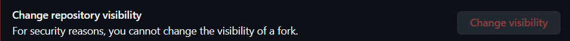

# Docker GHA Training

The goal of this training is to learn how to use Docker and GitHub Actions to build, test and deploy a simple web application. In this training, we will use a simple web application written in Python and Flask.

## License

This project is licensed under the MIT License - see the [LICENSE](LICENSE) file for details.

# Docker Image Creation (8 points)

## 1. Fork the repo: https://github.com/emmanuelgautier/docker-gha-training
We can't put it private because the repo is public.


## 2. Create the dockerfile
Using `python:3.12-slim` the lightweight base image. The `--no-cache-dir` option in `pip install` ensures that no unnecessary files are cached, keeping the image size minimal. Setting `PYTHONDONTWRITEBYTECODE=1` and `PYTHONUNBUFFERED=1` improves performance and ensures predictable behavior.

## 3. Build the Docker Image
I used the following command to build the Docker image:
```bash
docker build -t myapp:1 .
```

## 4. Run the Docker Container
Run the container using the built image, expose port 5000 on the container to port 8080 on the host, and name the container `myapp_container`:
```bash
docker run -d -p 8080:5000 --name myapp_container myapp:1
```

## 5. Confirm that the container is running and accessible
To confirm that the container is running, I used the following command:
```bash
docker ps
```


# Docker Compose Configuration (5 points)

## 1. Create the docker-compose
Running a `myapp` service on `8080:5000` and automatically restart the service if it crashes with `restart: always`.

## 2. Configure the Postgres Service
### a. Using the `postgres:17.5` image, which is the latest official image. The service is configured with a volume for data persistence.  

### b. Secure Environment Variables with Docker Swarm Secrets

Run the following commands to create the secrets for `POSTGRES_USER`, `POSTGRES_DB`, and `POSTGRES_PASSWORD`:
```bash
echo "myuser" | docker secret create postgres_user -
echo "mydatabase" | docker secret create postgres_db -
echo "your_secure_password_here" | docker secret create postgres_password -
```


Then run :
```bash
docker stack deploy -c docker-compose.yml my_stack
```

## 3. Ensure Database is ready before starting myapp

Using `depends_on` on myapp service and adding a `healthcheck` on postgres service.

## 4. Start the Docker Compose stack
Using the following command :
```bash 
docker stack deploy -c docker-compose.yml my_stack
```
We can't use docker-compose up with Swarm secrets.

# Continuous Integration / Continuous Deployment with Github Actions (4 points)

## 1. Build and Push Docker Image Workflow
This workflow builds and pushes the Docker image to the GitHub Container Registry whenever there is a push to the `main` branch. The workflow file is located at `.github/workflows/build-and-push.yml`.

## 2. Build and Test Workflow
This workflow builds and tests the project on every push to any branch. The workflow file is located at `.github/workflows/build-and-test.yml`.

# Testing and Submission (3 points)

## 1. Experience Completing the Exam
Completing this exam was a rewarding experience that allowed me to apply my knowledge of Docker, Docker Compose, and GitHub Actions. One of the main challenges I faced was managing secrets securely using Docker Swarm. Initially, I encountered errors when trying to use external secrets, as they were not properly created or recognized. To overcome this, I ensured that Docker Swarm was initialized and used the correct commands to create secrets. Additionally, I verified the secrets using `docker secret ls` and updated the `docker-compose.yml` file to reference them as external secrets. This process taught me the importance of securely managing sensitive data in a production environment.

## 2. Next Steps for Production Readiness
To make this stack and the Docker images production-ready, the next step would be implement logging and monitoring. Add tools like Prometheus and Grafana to monitor the health and performance of the services. This will help ensure the system remains reliable and issues can be identified and resolved quickly.